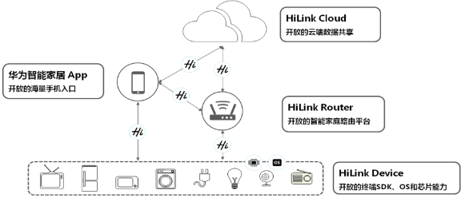
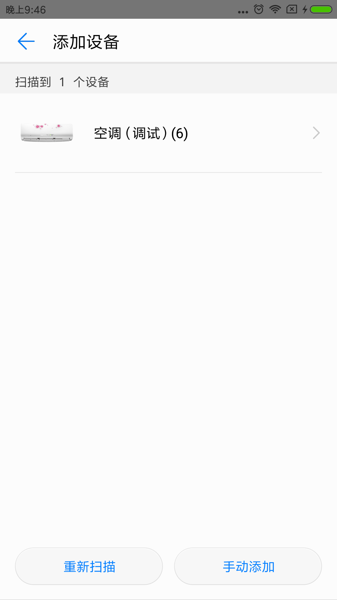
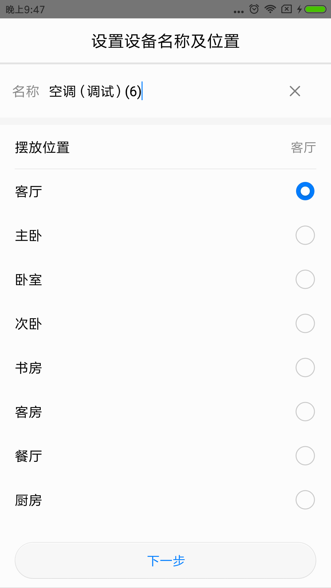
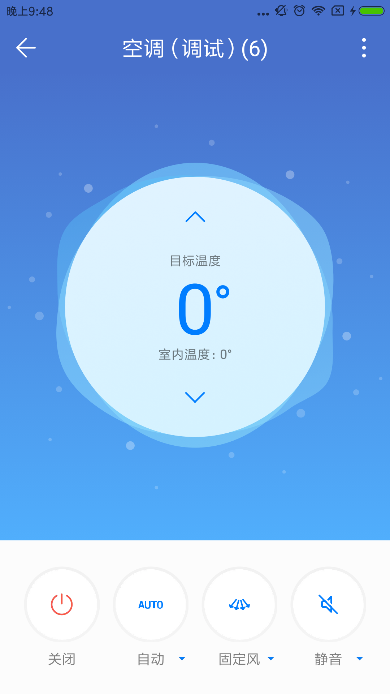
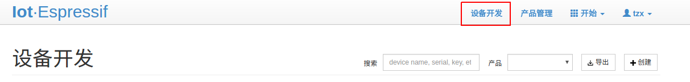
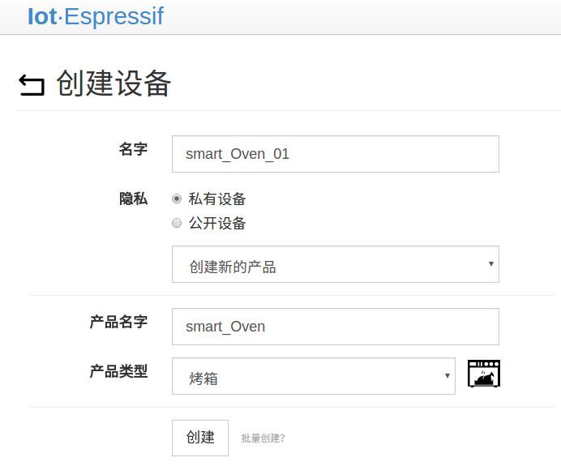
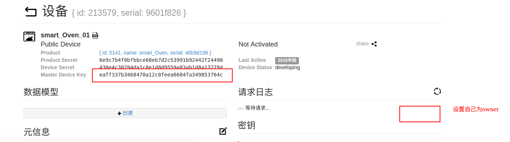
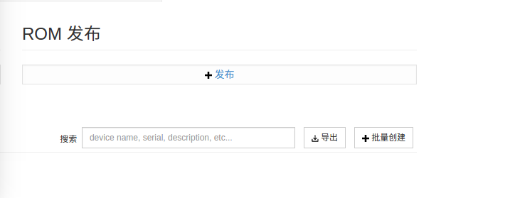
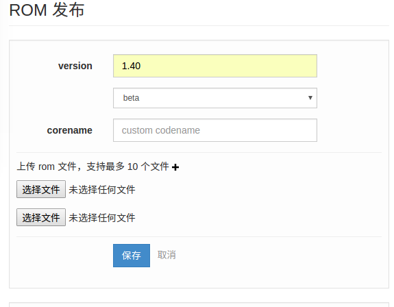
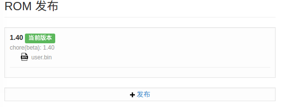

## 1.HUAWEI HiLink协议介绍
   当前智能家居领域，各品牌厂家之间，就像各省的方言一样，不能互联互动，从而形成一个个孤岛，这和给消费者提供更美好生活本质背离。HUAWEI HiLink，就是为各智能终端之间提供的普通话。

   对行业，华为开放协议SDK，并建设开发者社区为开发者提供全方位的指导，帮助开发者从开发环境搭建到集成、测试、提供一站式的开发服务。华为通过HUAWEI HiLink互联协议，将和所有智能硬件厂家一起，形成开放、互通、共建的智能家居生态。

## 2.HILINK 的架构
   HUAWEI HiLink开放互联协议架构：连接人、端、云

   

1. HUAWEI HiLink协议框架主要部件：HUAWEI HiLink Device：开放的终端SDK、OS和芯片能力
a)集成HUAWEI HiLink SDK，实现终端快速入网、能力开放和设备间互操作
b)可支持WiFi/Zigbee/BT

2. 华为智能家居 App：开放的海量手机入口
a)统一入口、统一体验
b)单设备管理和控制
c)多设备联动和场景设置
3. HUAWEI HiLink Cloud：开放的云端数据共享
a)多设备管理
b)场景联动
c)远程控制
d)视音频媒体能力
e)OpenAPI第三方对接
4. HUAWEI HiLink Router：开放的智能家居路由平台
a)一键连接、自组网、自动漫游
b)多设备协同和场景联动
c)多协议、多标准转换

## 3.软硬件准备
  1. 软件准备：1.熟悉hilink sdk接入手册，本工程docs目录下HILINK开发资料，需要根据具体设备适配profile文件中的服务类型;2.熟悉8266的开发平台，参考bbs.espressif.com中的8266相关文档，下载相关编译及烧录工具.您可以使用 xcc 和 gcc 来编译项目，建议使用 gcc。对于 gcc，请参考[esp-open-sdk](https://github.com/pfalcon/esp-open-sdk)
  2. 硬件准备：准备一块wroom02开发板,flash不少于2MB，

## 4.工程结构

    ├── bin
    ├── docs
    ├── esp8266-rtos-sdk-hilink    //hilink 8266 sdk ,open SOCKET REUSE of lwip
    ├── genmisc.sh                 //生成固件脚本
    ├── hilink_ota                 //OTA 相关的适配例子，使用iot.espressif.cn作为OTA服务，华为提供的空调demo作为具体设备，若是使用客户自己的升级服务器该部分可以直接去掉
    │   ├── hilink_ota.c
    │   ├── hilink_ota_config.h    //OTA配置文件
    │   ├── hilink_ota_crc32.c
    │   ├── hilink_ota_lib.c
    │   ├── Makefile
    │   └── README.md              //OTA帮助文档
    ├── Makefile
    ├── platforms
    │   ├── hilink
    │   │   ├── adaptation
    │   │   │   ├── hilink_error.h
    │   │   │   ├── hilink_esp_link.c   //Hilink 配网相关
    │   │   │   ├── hilink_esp_m2m.c     //m2m函数适配接口
    │   │   │   ├── hilink_osadapter.c   //库函数适配接口
    │   │   │   ├── hilink_socket_stub.c  //网络层适配接口
    │   │   │   └── Makefile
    │   │   ├── include
    │   │   │   ├── hilink_esp_adapter.h   //esp新增的适配接口，需要调用
    │   │   │   ├── hilink_link.h
    │   │   │   ├── hilink_log.h
    │   │   │   ├── hilink_osadapter.h
    │   │   │   ├── hilink_profile.h
    │   │   │   └── hilink_socket.h
    │   │   ├── lib
    │   │   │   └── libhilinkdevicesdk.a
    │   │   └── Makefile
    │   └── Makefile
    ├── README.md
    └── user
        ├── hilink_demo.c               //使用华为提供的调试空调作为例子
        ├── hilink_esp_m2m_adapter.c    //demo空调相关属性接口适配例子，客户需要根据自己的设备和华为提供的profile来适配
        └── Makefile


## 5.编译运行
   在unix环境下只需要运行./genmisc.sh,其他环境请参考[esp-open-sdk](https://github.com/pfalcon/esp-open-sdk)

## 6. 固件烧录（windows）
1. 安装[串口驱动](http://www.usb-drivers.org/ft232r-usb-uart-driver.html)
2. 安装[烧写工具](http://espressif.com/en/support/download/other-tools)
3. 烧录相关 bin 文件
将 GPIO0 开关（GPIO0 Control）拨到内侧开发板置为下载模式，按照如下所示，配置串口号、串口波特率等，按 `START` 即可开始下载程序

    

```
    boot.bin------------------->0x000000    // 启动程序
    user1.2048.new.5.bin------->0x01000     // 主程序
    blank.bin------------------>0x1F8000    // 初始化用户参数区
    blank.bin------------------>0x1FB000    // 初始化 RF_CAL 参数区。
    esp_init_data_default.bin-->0x1FC000    // 初始化其他射频参数区
    blank.bin------------------>0x1FE000    // 初始化系统参数区
```

## 7. APP添加注册控制
  上电后设备之前若有没有进行过配网，会自动进入配网状态，app可以扫到该设备进行添加注册，如图：

  

  手机app根据设备广播的beacon信息来显示热点信息配网完成后进入注册页面，注册页面可以选择设备的摆放位置

  

  注册完成后进入设备详情界面，可以在设备点击控制之后可以在串口看到设备收到的控制命令

  

  例如设置制冷模式,串口输出：
  ```
  put svc_id is airConditioner payload is {"mode":2}
  mode value 2
  get svc_id airConditioner in        0 (null)
  out {"mode":2}

  ```

## 8.升级功能适配步骤
  由于华为hilink不提供升级服务器，所以升级服务器功能需要客户根据自己的产品特性独立开发。本工程下升级功能适配的例子是基于iot.espressif.cn开发的，用户若是使用该服务器实现OTA功能请按照一下步骤进行，若是客户准备自行开发升级服务器也可参考升级部分的适配代码.
### (a)云端配置以及上传升级固件
  1.注册iot.espressif.cn(http://iot.espressif.cn/#/join/)

  2.注册完成后登录，点击设备开发->创建

  

  3.点击创建后到如下界面，可以自定义产品名字和类型

  

  4.创建设备成功后进入如下界面，记录下设备的master device,并且设置自己为owner

  

  5.再次点击页面右上角的设备管理

  

  6.选中刚才创建的设备类型，进入如下界面

  

  7.上传需要升级的固件，并且设定版本号

  

  

  8.设定为当前最新版本

  

### (b)设备端修改适配步骤
  1.只需修改hilink_ota目录下的hilink_ota_config.h
  ```
  #define OTA_SERVER_ADDR "115.29.202.58" //iot.espressif.cn的ip地址，不用动
  #define OTA_SERVER_PORT 80              //服务器端口，不用动
  #define BIN_FILENAME "user.bin"         //上传的升级固件文件名称,云端第七步上传的是文件名是user.bin
  #define OTA_TIMEOUT 60000               //升级超时时间，可以改动

  #define MASTER_KEY "eaff337b3468470a12c0feea6604fa349853764c" //填入云端第4步的master_devide_key
  ```
